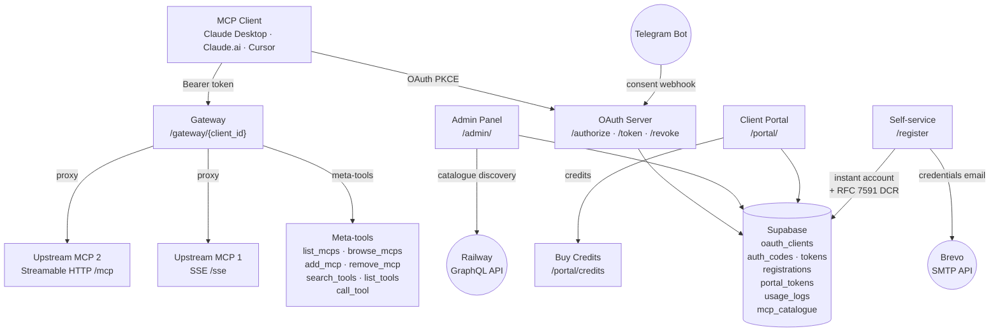

# DS-MOZ Intelligence — MCP OAuth Server

OAuth 2.0 authorization server and AI gateway for Claude Desktop, Claude.ai, and Cursor. Handles the full Authorization Code + PKCE flow, self-service client registration, a client portal, and a single gateway endpoint that proxies multiple upstream MCP servers per client.

**Live:** `https://mcp.dsmozconsultancy.com`

---

## Architecture



---

## Endpoints

### OAuth / Discovery
| Endpoint | Method | Description |
|----------|--------|-------------|
| `/.well-known/openid-configuration` | GET | OIDC discovery document |
| `/.well-known/oauth-authorization-server` | GET | OAuth AS metadata (alias) |
| `/.well-known/oauth-protected-resource` | GET | RFC 9728 protected resource metadata |
| `/authorize` | GET | Start authorization flow |
| `/authorize/consent` | GET | Telegram approval gate / password fallback |
| `/consent/status` | GET | Poll consent status (pending/approved/denied) |
| `/consent/complete` | GET | Post-approval confirmation page |
| `/token` | POST | Authorization code / refresh token exchange |
| `/revoke` | POST | Token revocation (RFC 7009) |
| `/introspect` | POST | Token introspection (internal — for upstream MCPs) |
| `/register` | POST | RFC 7591 dynamic client registration |
| `/telegram/webhook` | POST | Telegram bot callback |

### Self-service Registration
| Endpoint | Method | Description |
|----------|--------|-------------|
| `/register` | GET | Registration form |
| `/register/submit` | POST | Submit — creates client instantly, sends credentials email |
| `/register/success` | GET | Confirmation page |

### Gateway

| Endpoint                    | Method          | Description                  |
|-----------------------------|-----------------|------------------------------|
| `/gateway/{client_id}`      | GET/POST/DELETE | Streamable HTTP MCP endpoint |
| `/gateway/{client_id}/mcp`  | GET/POST/DELETE | Alias — same handler         |

### Client Portal
| Endpoint | Method | Description |
|----------|--------|-------------|
| `/portal/login` | GET/POST | Portal login |
| `/portal/setup-password` | GET/POST | First-login password setup (one-time token) |
| `/portal/` | GET | Overview — usage stats, credit balance, gateway URL |
| `/portal/mcps` | GET/POST | Toolbox — enable/disable MCPs |
| `/portal/setup` | GET | Setup guide — Claude Desktop / Cursor config |
| `/portal/credits` | GET | Buy Credits page |
| `/portal/credits/buy` | POST | Purchase plan (dummy — grants credits immediately) |

### Admin Panel
| Endpoint | Method | Description |
|----------|--------|-------------|
| `/admin/` | GET | Dashboard — stats grid, recent clients |
| `/admin/clients/` | GET | Client list (with bulk delete) |
| `/admin/clients/{id}` | GET | Client detail — usage, credits, portal credentials |
| `/admin/clients/{id}/edit` | GET/POST | Edit name and redirect URIs |
| `/admin/clients/{id}/rekey` | POST | Rotate client secret |
| `/admin/clients/{id}/revoke` | POST | Revoke all tokens |
| `/admin/clients/{id}/delete` | POST | Hard delete client |
| `/admin/clients/{id}/tokens` | GET | Token inspector |
| `/admin/clients/{id}/set-portal-credentials` | POST | Set portal username/password |
| `/admin/clients/{id}/add-credits` | POST | Add credits to client balance |
| `/admin/registrations/` | GET | Registration request log |
| `/admin/registrations/{id}` | GET | Registration detail |
| `/admin/catalogue` | GET | MCP catalogue (Railway-sourced) |

---

## Client Onboarding Flow

1. Client visits `/register`, fills in company name, email, use case
2. OAuth client created immediately — no admin approval needed
3. Credentials email sent via Brevo: Client ID, Client Secret, gateway URL, setup instructions for Claude.ai / Claude Desktop / Cursor / ChatGPT
4. Client follows one-time portal link to set password
5. Client lands on `/portal/mcps` to configure their toolbox
6. Client adds credits via `/portal/credits` to enable tool calls

---

## Credit System

- Each client has a `credit_balance` on `oauth_clients`
- Each MCP in the catalogue has a `credit_cost_per_call` (default 0)
- Meta-tools (`browse_mcps`, `add_mcp`, etc.) are always free
- `call_tool` checks balance before proxying; deducts on success
- Admin can add credits manually via client detail page
- Clients can "buy" credits via portal plan cards (Starter 10cr/$10 · Pro 50cr/$40 · Enterprise 200cr/$150)

---

## Gateway Meta-tools

The gateway exposes these tools to the LLM on every connection:

| Tool | Description |
|------|-------------|
| `list_mcps` | List MCP servers currently in the client's toolbox |
| `browse_mcps` | Browse all published MCPs with enabled status |
| `add_mcp` | Add an MCP to the toolbox (persists to DB) |
| `remove_mcp` | Remove an MCP from the toolbox |
| `search_tools` | Keyword search across all enabled MCP tools |
| `list_tools` | List tools for a specific MCP |
| `call_tool` | Proxy a tool call to an upstream MCP (credit-gated) |

---

## Environment Variables

| Variable | Required | Description |
|----------|----------|-------------|
| `SUPABASE_URL` | Yes | Supabase project URL |
| `SUPABASE_SERVICE_KEY` | Yes | Supabase service role key |
| `OAUTH_ISSUER_URL` | Yes | Public base URL (`https://mcp.dsmozconsultancy.com`) |
| `ADMIN_USERNAME` | Yes | HTTP Basic auth username for `/admin/` |
| `ADMIN_PASSWORD` | Yes | HTTP Basic auth password for `/admin/` |
| `SECRET_KEY` | Yes | Signing key for portal session cookies |
| `INTROSPECT_SECRET` | Yes | Shared secret for `/introspect` endpoint |
| `TELEGRAM_BOT_TOKEN` | Recommended | Enables Telegram consent approval gate |
| `TELEGRAM_OWNER_CHAT_ID` | Recommended | Owner's Telegram chat ID |
| `BREVO_API_KEY` | Recommended | Brevo API key — enables credentials email |
| `BREVO_SENDER_EMAIL` | Recommended | Sender email address |
| `BREVO_SENDER_NAME` | Optional | Sender display name (default: DS-MOZ Intelligence) |
| `RAILWAY_API_TOKEN` | Recommended | Railway API token — enables catalogue auto-discovery |
| `RAILWAY_PROJECT_ID` | Recommended | Railway project UUID |

---

## Local Development

```bash
uv venv && source .venv/bin/activate
uv pip install -e .
cp .env.example .env   # fill in values
python main.py
```

## Deployment

Deployed on Railway via `Dockerfile`. Push to `main` → auto-deploy.

---

## Version History

| Version | Date | Summary |
|---------|------|---------|
| 1.9.0 | 2026-04-04 | RFC 7591 dynamic client registration, ASGI gateway middleware, Claude Desktop connector support |
| 1.8.0 | 2026-04-04 | Instant registration, credit system, Buy Credits portal page, toolbox rename |
| 1.7.0 | 2026-04-04 | Admin MCP catalogue with Railway auto-discovery |
| 1.6.0 | 2026-04-04 | DS-MOZ Intelligence Gateway — multi-MCP proxy per client |
| 1.5.0 | 2026-04-04 | Client portal (login, overview, MCP selection, setup guide) |
| 1.4.0 | 2026-04-04 | RFC 7591 dynamic registration, RFC 9728, Cursor support |
| 1.3.0 | 2026-04-04 | Visual identity — DS-MOZ brand, Phosphor icons |
| 1.2.0 | 2026-04-04 | Admin enhancements, self-service registration, portal credentials |
| 1.1.0 | 2026-04-04 | Telegram approval gate |
| 1.0.0 | 2026-01-17 | Core OAuth 2.0 server |
